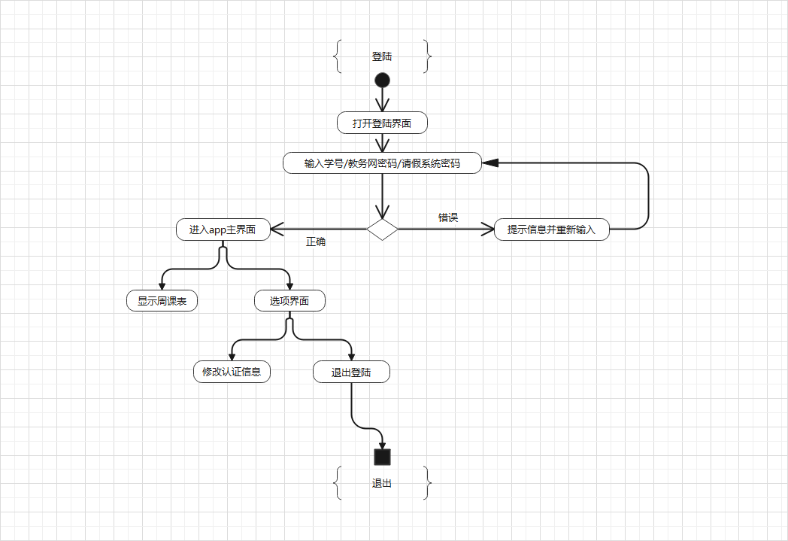
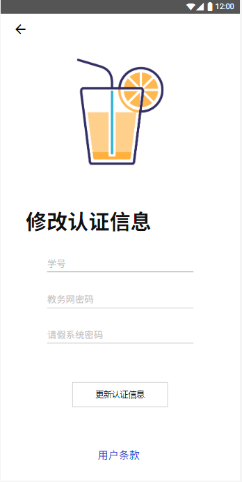
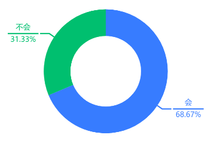
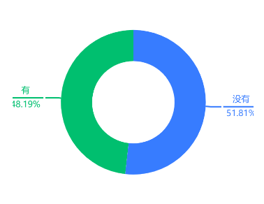
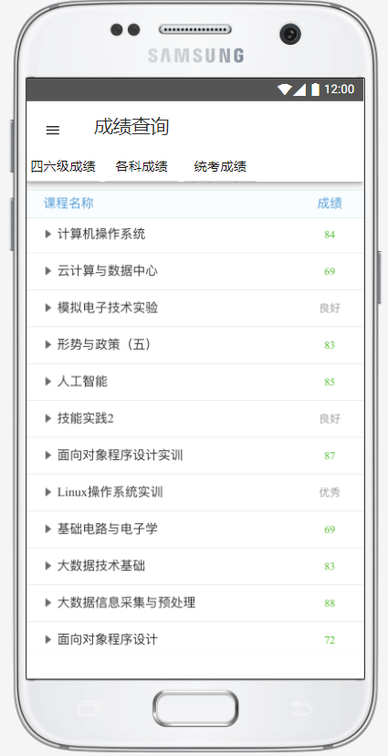
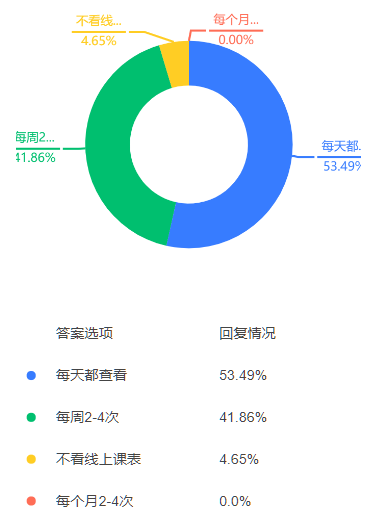

{width="1.8965277777777778in"
height="2.3041666666666667in"}

"橙汁"软件需求分析书

所属学校： [福州大学至诚学院]{.ul}

团队名称：[Happy tree friends]{.ul}

接手团队： [PlanB]{.ul}

指导老师： [张栋]{.ul}

项目时间：2020-2021第二学期

# 目录 {#目录 .TOC-标题1}

第一章 引言 1

[1.1编写目的 1](\l)

[1.2预期读者 1](\l)

[1.3项目背景 1](\l)

[1.4术语说明 2](\l)

[1.5参考资料 2](\l)

[第二章 系统说明 3](\l)

[2.1产品背景 3](\l)

[2.2产品描述 3](\l)

[2.3产品Logo 3](\l)

[2.4产品功能 4](\l)

[2.4.1类图 4](\l)

[2.4.2主要功能说明 4](\l)

[2.4.3活动图 5](\l)

[2.5产品市场 5](\l)

[2.6用户特点 5](\l)

[2.6.1用户群体画像 5](\l)

[2.6.2用户场景 6](\l)

[2.7运行环境 7](\l)

[2.8约束（条件与限制） 7](\l)

[第三章 运行接口需求 8](\l)

[3.1用户界面 8](\l)

[3.2硬件接口 9](\l)

[3.3软件接口 12](\l)

[3.4通信接口 12](\l)

[第四章 非功能性需求 13](\l)

[4.1性能需求 13](\l)

[4.2软件属性 13](\l)

[4.2.1软件可靠性 13](\l)

[4.2.2可用性 13](\l)

[4.2.3安全保密性 13](\l)

[4.2.4可维护性 13](\l)

[第五章 验证验收标准 14](\l)

# 

# 第一章 引言

## 1.1编写目的

该文档给出项目的整体结构和功能结构概貌，试图从总体架构上给出整个系统的轮廓。同时对功能需求、性能需求进行了详细的描述。便于用户、开发人员进行理解和交流。同时该文档也可以作为软件开发工作的基础和依据以及确认测试和验收的依据。

## 1.2预期读者

本文档面向多种读者对象：

（1）项目经理：项目经理可以根据该文档了解预期产品的功能，并据此进行系统设计、项目管理。

（2）设计员：对需求进行分析，完成对框架 、数据库、UI等的设计。

（3）程序员：根据本文档对软件进行开发工作。

（4）测试员：根据本文档编写测试用例，并对软件产品进行功能性测试和非功能性测试。

（5）用户：了解预期产品的功能和性能，并与分析人员一起对整个需求进行讨论和协商。

在阅读本文档时，首先要了解产品的功能概貌，然后可以根据自身的需要对每一项功能进行适当的了解。

## 1.3项目背景

软件名称：橙汁

开发者：福州大学至诚学院计算机系2017级 \"Happy tree friends\"

开发者：福州大学至诚学院计算机系2018级 \"PlanB\"团队

本项目由2018级\"PlanB\"团队接手2017级 \"Happy tree
friends\"团队项目，进行再次开发，对"橙汁"的部分功能进行修改，完善。经过用户需求问卷调研，深入分析用户需求，了解到现在全院学生不需要指纹打卡，所以我们团队移除该功能，而且根据需求表明同学们对课表的便捷操作和简洁化，和成绩查询等功能有更大的需求，所以我们团队将对"橙汁"APP的界面进行改进，并且添加成绩查询（如：学期课程成绩，四六级成绩等）的功能。课前提醒，界面自定义等功能，使橙汁功能多样化，可以为同学们提供更多便利，使之面向更多的学生群体。

## 1.4术语说明

表1-1 术语/定义

---------- ------ -----------------------------------------------------------
  **序号**   缩写   定义
  **1**      App    应用程序，Application的缩写，主要指安装在智能手机上的软件
  **2**      UI     用户界面，User Interface的缩写
  **3**      HTTP   HyperText Transfer Protocol的缩写，超文本传输协议
---------- ------ -----------------------------------------------------------

## 1.5参考资料

\[1\]《GB9385-2008 计算机软件需求规格说明规范》

\[2\]《GB9386-2008 计算机软件测试文档编制规范》

\[3\]《SJ11234-2001 软件过程能力评估模型》

\[4\]《构建之法》第三版 作者：邹欣

\[5\]《软件工程》第八版 作者：罗杰 S.普莱斯曼

# 第二章 系统说明

## 2.1产品背景

PlanB团队接手"橙汁"开发橙汁2.0版本。

基于林涛学长的"橙汁"APP对部分功能进行修改和优化。

福州大学至诚学院的学生课程表需要在至诚微信公众号经过多次点击来查看，并且课程信息的查看也有些繁琐，为了使公众号查询操作更加便利，界面更加美观，我们想开发一款至诚学生专用的课程表APP，代替微信公众号的课表并添加成绩查询、课前提醒、界面自定义等功能。

## 2.2产品描述

产品使用Android
Studio开发，课表界面展示和数据获取是其核心功能，主要满足用户及时查看课表的需求，且用户可以根据自己的喜好自定义课表界面。其次是成绩查询功能，用户可以很方便的查看到自己的成绩。我们还添加了课前提醒功能，以免同学们忘记上课或者走错教室。我们的APP实现了部分至诚教务助手的功能，用户使用我们产品可以极大简化查询课表信息和查询成绩的流程。

## 2.3产品Logo

{width="1.3541666666666667in"
height="1.6458333333333333in"}

图2\--3-1 LOGO

## 2.4产品功能

-   实时查看课表

-   课前提醒

-   查询成绩

-   界面自定义

### 2.4.1类图

{width="5.227083333333334in"
height="2.6493055555555554in"}

图2-4-1.1 类图

### 2.4.2主要功能说明

表2-1 主要功能

---------- -------------- -------------- -------- ------------------------------------------------------------
  **序号**   功能名称       功能需求标识   优先级   简要解释
  **1**      用户认证       L1             高       进入页面，输入学号、教务网密码、至诚信息系统密码
  **2**      周课表         L2             高       信息认证成功后显示个人周课表
  **3**      课前提醒       L3             高       信息认证成功后可增添课前提醒功能
  **4**      成绩查询       L4             中       信息认证成功后可查询成绩单
  **5**      认证信息修改   L5             中       若用户在教务网或至诚信息系统修改了密码，更改软件存储的密码
---------- -------------- -------------- -------- ------------------------------------------------------------

### 2.4.3活动图

{width="4.529861111111111in"
height="3.9298611111111112in"}

图2-4-3.1 活动图

## 2.5产品市场

该产品面对全体至诚学生，满足学生对课表查询和成绩查询的需求，解决学校微信公众号"至诚教务助手"使用不便的现象，为福州大学至诚学院的学生提供一个更节省时间的APP。

## 2.6用户特点

### 2.6.1用户群体画像

因为课表查询步骤繁琐和成绩查询步骤繁琐而苦恼的至诚学生。

### 2.6.2用户场景

表2-6-2.1 用户A场景

---------- ----------------------------------------------------------------------------
  姓名       用户A
  性别       男
  困难       至诚教务助手公众号偶尔会出现崩溃的状况，无法查询课表
  典型场景   由于系统崩溃造成用户A无法再次进入公众号查询课表，用户A不知道每天的课程信息
  用户定位   本产品提供实时课表查询，更加方便快捷
---------- ----------------------------------------------------------------------------

表2-6-2.2 用户B场景

---------- -----------------------------------------------------------------------------------------------------------
  姓名       用户B
  性别       男
  困难       至诚教务助手公众号课表只能查看近几周课表，而不能查看完整的一学期课表
  典型场景   用户B想查看最后一节课的结课时间，但是周课表只显示近几周课表，而完整课表没有提供日期，无法进行结课时间推算
  用户定位   本产品提供实时课表查询，可以查看整个学期的所有周课表
---------- -----------------------------------------------------------------------------------------------------------

表2-6-2.3 用户C场景

---------- -------------------------------------------------------------------------------
  姓名       用户C
  性别       男
  困难       日常迷糊，总是分不清今天上哪节课
  典型场景   C是一个性格大大咧咧且日常犯迷糊的小朋友，总是不知道今天的课程是什么，几点上课
  用户定位   本产品提供课前提醒功能，可以提前通知用户上课日程
---------- -------------------------------------------------------------------------------

表2-6-2.4 用户D场景

---------- -----------------------------------------------------------------------------------
  姓名       用户D
  性别       女
  困难       对今日课程记不清课程所对应的教室
  典型场景   D同学去上课的过程中需要查询教室，但登录微信进去至诚教务助手查询教室，过程相对繁琐
  用户定位   本产品主界面提供课程对应的教室，可直接查看
---------- -----------------------------------------------------------------------------------

表2-6-2.5 用户E场景

---------- -------------------------------------------------------------------------------
  姓名       用户E
  性别       男
  困难       至诚教务助手公众号成绩查询对于每学期的分类不够明确
  典型场景   E同学想看自己每学期的成绩，而教务助手显示的是所有学期的成绩，浏览起来不够便利
  用户定位   本产品可以提供方便快捷的成绩查询
---------- -------------------------------------------------------------------------------

### 2.6.3用户需求

{width="2.2756944444444445in"
height="1.757638888888889in"}

图2\--6-3.1 用户使用课程表软件的情况

{width="2.3604166666666666in"
height="1.6236111111111111in"}

图2\--6-3.2 用户是否会使用"橙汁"APP

{width="2.196527777777778in"
height="3.136111111111111in"}

图2\--6-3.3 用户使用线上课表的频率

{width="2.6333333333333333in"
height="4.9118055555555555in"}

图2\--6-3.4 用户期待的功能

## 2.7运行环境

运行要求：Android5.0及以上

## 2.8约束（条件与限制）

-   项目开发经验约束：PlanB组员均为大三学生，没有开发完整项目的经验，需要借鉴学习。

-   管理约束：各个组员都是第一次协作完成项目，任务的拆分和协作对组长和组员来说都是考验。当项目遇到了技术性难题后由组长合理给出策略，队员们互相协作更好的完成此次项目。

-   技术约束：实现对至诚教务网和至诚信息系统的模拟登录存在一定的难度；至诚教务网验证码的识别也存在一定的难度。

-   网络传输约束：用户网络速率会影响软件的用户体验，软件数据的获取依赖手机与教务网和至诚信息系统的网络连接。

-   安全和保密约束：对用户敏感数据的存储和传输进行加密。

# 第三章 运行接口需求

## 3.1用户界面

###  3.1.1登录及主界面

{width="2.5145833333333334in"
height="5.591666666666667in"}{width="2.5166666666666666in"
height="5.594444444444444in"}

> 图3-1-1 主界面 图3-1-2 周课表

### 3.1.2菜单栏界面

### {width="3.5881944444444445in" height="6.856944444444444in"}

图3-5 功能选项

### 3.1.3成绩查询界面

### {width="3.571527777777778in" height="6.957638888888889in"}

图3-5 功能选项

### 3.1.4认证更新界面 

{width="2.797222222222222in"
height="5.548611111111111in"}

> 图3-7 认证信息修改

## 3.2硬件接口

-   客户端

    -   Android兼容的手机

    -   网络连接支持

## 3.3软件接口

-   客户端

```{=html}
<!-- -->
```
-   Android版本5.0及以上

## 3.4通信接口

-   网络连接使用HTTP

# 第四章 非功能性需求

## 4.1性能需求

-   支持100+人同时发起请求获取课表或读取成绩信息

## 4.2软件属性

###  4.2.1软件可靠性

-   在Android5.0及以上的系统稳定运行

-   在软件非正常退出时，确保用户数据不丢失

###  4.2.2可用性

-   并发性：支持多用户同时请求数据

-   操作便捷：简单快捷地获取课表及签到信息

-   界面简洁：没有广告或其他无用的界面

###  4.2.3安全保密性

-   最小权限原则：只获取必要的权限，保护用户的隐私

-   数据传输：使用教务网和至诚信息系统指定的加密规则对数据进行加密传输

-   本地存储：对于用户的敏感数据进行加密存储

###  4.2.4可维护性

-   版本控制：使用版本控制工具辅助开发

-   开发规范：根据实际情况制定合适的开发规范，共同遵守，提高代码可读性和可维护性

-   模块化设计：各个功能采用模块化设计，便于各个模块的设计开发与维护

# 第五章 验证验收标准

表5-1 验证验收标准

+----------+----------+----------+----------+----------+----------+
| **测     | **       | **输入   | **       | **预     | **验     |
| 试功能** | 测试项** | /操作**  | 检验点** | 期结果** | 收情况** |
+----------+----------+----------+----------+----------+----------+
| **登录** | 初始界面 | 点击账   | 账       | 账号和   |          |
|          |          | 号和密码 | 号、密码 | 密码的文 |          |
| **界面** |          | 的文本框 | 键入提示 | 本框显示 |          |
|          |          | （若存在 |          | 键入提示 |          |
|          |          | 登陆信息 |          | 且可键入 |          |
|          |          | ，跳过） |          |          |          |
+----------+----------+----------+----------+----------+----------+
|          |          | 键入账号 | 账号为9  | 对于不满 |          |
|          |          | 文本框、 | 位数学号 | 足学号要 |          |
|          |          | 输入文本 |          | 求的文本 |          |
|          |          |          |          | 可以进行 |          |
|          |          |          |          | 预先识别 |          |
|          |          |          |          | 、并提示 |          |
+----------+----------+----------+----------+----------+----------+
|          |          | 键入     | 教       | 对       |          |
|          |          | 密码文本 | 务网密码 | 不符合密 |          |
|          |          | 框、输入 |          | 码规则的 |          |
|          |          | password |          | 文本进行 |          |
|          |          |          |          | 预先识别 |          |
|          |          |          |          | 、并提示 |          |
+----------+----------+----------+----------+----------+----------+
|          |          | 键入     | 至诚信息 | 对       |          |
|          |          | 密码文本 | 系统密码 | 不符合密 |          |
|          |          | 框、输入 |          | 码规则的 |          |
|          |          | password |          | 文本进行 |          |
|          |          | （选填） |          | 预先识别 |          |
|          |          |          |          | 、并提示 |          |
+----------+----------+----------+----------+----------+----------+
|          |          |          | APP Logo | Logo图标 |          |
|          |          |          |          | 清晰完整 |          |
+----------+----------+----------+----------+----------+----------+
|          | 登录功能 | 点       | 账号密码 | 成功进   |          |
|          |          | 击"登录  | 校验，并 | 入主界面 |          |
|          |          | "按钮，  | 显示登录 |          |          |
|          |          |          | 结果信息 |          |          |
|          |          | 学号     |          |          |          |
|          |          | ，教务网 |          |          |          |
|          |          | 、至诚信 |          |          |          |
|          |          | 息系统密 |          |          |          |
|          |          | 码都填写 |          |          |          |
|          |          | 并且正确 |          |          |          |
+----------+----------+----------+----------+----------+----------+
|          |          | 点       | 显示     | 提       |          |
|          |          | 击"登录  | 提示信息 | 示"未输  |          |
|          |          | "按钮，  |          | 入学号"  |          |
|          |          | 未写学号 |          |          |          |
+----------+----------+----------+----------+----------+----------+
|          |          | 点       | 显示     | 提       |          |
|          |          | 击"登录  | 提示信息 | 示"未输  |          |
|          |          | "按钮，  |          | 入密码"  |          |
|          |          |          |          |          |          |
|          |          | 学号     |          |          |          |
|          |          | 正确，未 |          |          |          |
|          |          | 输入密码 |          |          |          |
+----------+----------+----------+----------+----------+----------+
|          |          | 点       | 显示     | 提示"学  |          |
|          |          | 击"登录  | 提示信息 | 号有误"  |          |
|          |          | "按钮，  |          |          |          |
|          |          |          |          |          |          |
|          |          | 学号格式 |          |          |          |
|          |          | 错误或学 |          |          |          |
|          |          | 号未存在 |          |          |          |
+----------+----------+----------+----------+----------+----------+
|          |          | 点       | 账号     | 进入主   |          |
|          |          | 击"登录  | 密码校验 | 界面，仅 |          |
|          |          | "按钮，  | ，并显示 | 显示课表 |          |
|          |          |          | 提示信息 | ，签到提 |          |
|          |          | 学号正   |          | 示功能、 |          |
|          |          | 确，教务 |          | 本班未签 |          |
|          |          | 网密码正 |          | 功能停用 |          |
|          |          | 确，至诚 |          |          |          |
|          |          | 信息系统 |          |          |          |
|          |          | 密码未填 |          |          |          |
+----------+----------+----------+----------+----------+----------+
|          |          | 点击     | 账号     | 提示"    |          |
|          |          | 登陆按钮 | 密码校验 | 教务网密 |          |
|          |          | ，学号正 | ，并显示 | 码出错"  |          |
|          |          | 确，教务 | 提示信息 |          |          |
|          |          | 网密码错 |          |          |          |
|          |          | 误，至诚 |          |          |          |
|          |          | 信息系统 |          |          |          |
|          |          | 密码正确 |          |          |          |
+----------+----------+----------+----------+----------+----------+
|          |          | 点击     | 账号     | 提示     |          |
|          |          | 登陆按钮 | 密码校验 | "至诚信  |          |
|          |          | ，学号正 | ，并显示 | 息系统密 |          |
|          |          | 确，教务 | 提示信息 | 码出错"  |          |
|          |          | 网密码正 |          |          |          |
|          |          | 确，至诚 |          |          |          |
|          |          | 信息系统 |          |          |          |
|          |          | 密码错误 |          |          |          |
+----------+----------+----------+----------+----------+----------+
|          |          | 点击     | 显示     | 提       |          |
|          |          | 登陆按钮 | 提示信息 | 示"未输  |          |
|          |          | ，未输入 |          | 入学号"  |          |
|          |          | 任何信息 |          |          |          |
+----------+----------+----------+----------+----------+----------+
| **       | 课       |          | 初始界面 | 不同颜色 |          |
| 主界面** | 程表信息 |          |          | 的色块显 |          |
|          |          |          |          | 示课程信 |          |
|          |          |          |          | 息，在签 |          |
|          |          |          |          | 到时间段 |          |
|          |          |          |          | 显示签到 |          |
|          |          |          |          | 情况信息 |          |
+----------+----------+----------+----------+----------+----------+
|          |          | 动作--   | 刷新课表 | 将课     |          |
|          |          | ----下拉 |          | 表刷新至 |          |
|          |          |          |          | 最新状态 |          |
+----------+----------+----------+----------+----------+----------+
|          |          | 动       | 切换课表 | 切换     |          |
|          |          | 作------ |          | 当前显示 |          |
|          |          | 左右滑动 |          | 的周课表 |          |
+----------+----------+----------+----------+----------+----------+
| **       | 侧边     | 点击     | 初始界面 | 显示功能 |          |
| 菜单栏** | 菜栏界面 | "周课表" |          | 点：查询 |          |
|          |          |          |          | 本班未签 |          |
|          |          |          |          | 记录、修 |          |
|          |          |          |          | 改认证信 |          |
|          |          |          |          | 息、用户 |          |
|          |          |          |          | 退出登录 |          |
+----------+----------+----------+----------+----------+----------+
|          |          | 点击"成  | "成绩查  | 进入"成  |          |
|          |          | 绩查询"  | 询"功能  | 绩查询"  |          |
|          |          |          |          | 详情页面 |          |
+----------+----------+----------+----------+----------+----------+
|          |          | 点击     | "修      | 进入     |          |
|          |          | "修改认  | 改认证信 | "修改认  |          |
|          |          | 证信息"  | 息"功能  | 证信息"  |          |
|          |          |          |          | 详情界面 |          |
+----------+----------+----------+----------+----------+----------+
|          |          | 点       | "关      | 显       |          |
|          |          | 击"关于" | 于"功能  | 示"橙汁  |          |
|          |          |          |          | "开发团  |          |
|          |          |          |          | 队信息， |          |
|          |          |          |          | 版本信息 |          |
+----------+----------+----------+----------+----------+----------+
| **查询成 | 个人     | 用       | 初始界面 | 显示个   |          |
| 绩界面** | 成绩界面 | 户录入了 |          | 人四六级 |          |
|          | 详情界面 | 至诚信息 |          | 成绩、各 |          |
|          |          | 系统密码 |          | 科成绩、 |          |
|          |          |          |          | 统考成绩 |          |
+----------+----------+----------+----------+----------+----------+
|          |          | 用       | 初始界面 | 显示"    |          |
|          |          | 户未录入 |          | 未录入至 |          |
|          |          | 至诚信息 |          | 诚信息系 |          |
|          |          | 系统密码 |          | 统密码， |          |
|          |          |          |          | 在修认证 |          |
|          |          |          |          | 信息中添 |          |
|          |          |          |          | 加密码后 |          |
|          |          |          |          | 即可使用 |          |
|          |          |          |          | 该功能"  |          |
+----------+----------+----------+----------+----------+----------+
| **       | 修       | 点击     | 更新学号 | 提示"更  |          |
| 修认证信 | 认证信息 | "更新认  |          | 新学号"  |          |
| 息界面** | 详情界面 | 证信息"  |          |          |          |
|          |          | 、输入新 |          |          |          |
|          |          | 学号，未 |          |          |          |
|          |          | 输入密码 |          |          |          |
+----------+----------+----------+----------+----------+----------+
|          |          | 未输入   | 保持     | 提       |          |
|          |          | 任何信息 | 默认信息 | 示"未修  |          |
|          |          |          |          | 改信息"  |          |
+----------+----------+----------+----------+----------+----------+
|          |          | 点击"    | 更新教   | 提示"    |          |
|          |          | 更新认证 | 务网密码 | 更新教务 |          |
|          |          | 信息"按  |          | 网密码"  |          |
|          |          | 钮，只填 |          |          |          |
|          |          | 写新的教 |          |          |          |
|          |          | 务网密码 |          |          |          |
+----------+----------+----------+----------+----------+----------+
|          |          | 点击     | 更新     | 提示     |          |
|          |          | "更新认  | 至诚信息 | "更新至  |          |
|          |          | 证信息"  | 系统密码 | 诚信息系 |          |
|          |          | 按钮，只 |          | 统密码"  |          |
|          |          | 填写新的 |          |          |          |
|          |          | 至诚信息 |          |          |          |
|          |          | 系统密码 |          |          |          |
+----------+----------+----------+----------+----------+----------+
|          |          | 点       | 更新     | 提示     |          |
|          |          | 击"更新  | 学号、教 | "更新学  |          |
|          |          | 认证信息 | 务网密码 | 号、教务 |          |
|          |          | "按钮，  |          | 网密码"  |          |
|          |          |          |          |          |          |
|          |          | 修改     |          |          |          |
|          |          | 学号，教 |          |          |          |
|          |          | 务网密码 |          |          |          |
+----------+----------+----------+----------+----------+----------+
|          |          | 点       | 更新学号 | 提       |          |
|          |          | 击"更新  | 至诚信息 | 示"更新  |          |
|          |          | 认证信息 | 系统密码 | 学号、至 |          |
|          |          | "按钮，  |          | 诚信息系 |          |
|          |          |          |          | 统密码"  |          |
|          |          | 修       |          |          |          |
|          |          | 改学号， |          |          |          |
|          |          | 至诚信息 |          |          |          |
|          |          | 系统密码 |          |          |          |
+----------+----------+----------+----------+----------+----------+
|          |          | 点       | 更新学   | 提示"    |          |
|          |          | 击"更新  | 号、教务 | 更新学号 |          |
|          |          | 认证信息 | 网密码、 | 、教务网 |          |
|          |          | "按钮，  | 至诚信息 | 密码、至 |          |
|          |          |          | 系统密码 | 诚信息系 |          |
|          |          | 修改学   |          | 统密码"  |          |
|          |          | 号、教务 |          |          |          |
|          |          | 网密码、 |          |          |          |
|          |          | 至诚信息 |          |          |          |
|          |          | 系统密码 |          |          |          |
+----------+----------+----------+----------+----------+----------+
|          |          |          | APP Logo | Logo图标 |          |
|          |          |          |          | 清晰完整 |          |
+----------+----------+----------+----------+----------+----------+
|          | 修改认证 | 点击"修  | 账号密码 | 对       |          |
|          | 信息功能 | 改认证信 | 校验，并 | 于非法文 |          |
|          |          | 息"按钮  | 显示登录 | 本，以及 |          |
|          |          |          | 结果信息 | 账号密码 |          |
|          |          |          |          | 不匹配的 |          |
|          |          |          |          | 情况，返 |          |
|          |          |          |          | 回登录失 |          |
|          |          |          |          | 败信息， |          |
|          |          |          |          | 成功，将 |          |
|          |          |          |          | 数据进行 |          |
|          |          |          |          | 刷新并返 |          |
|          |          |          |          | 回主界面 |          |
+----------+----------+----------+----------+----------+----------+   
