“橙汁”软件需求分析书

所属学校： 福州大学至诚学院

团队名称：Happy tree friends

接手团队： PlanB

指导老师： 张栋

项目时间：2020-2021第二学期

目录

[第一章 引言	1](#_Toc36537101)

>   [1.1编写目的	1](#_Toc36537102)

>   [1.2预期读者	1](#_Toc36537103)

>   [1.3项目背景	1](#_Toc36537104)

>   [1.4术语说明	2](#_Toc36537105)

>   [1.5参考资料	2](#_Toc36537106)

[第二章 系统说明	3](#_Toc36537107)

>   [2.1产品背景	3](#_Toc36537108)

>   [2.2产品描述	3](#_Toc36537109)

>   [2.3产品Logo	3](#_Toc36537110)

>   [2.4产品功能	4](#_Toc36537111)

>   [2.4.1类图	4](#_Toc36537112)

>   [2.4.2主要功能说明	4](#_Toc36537113)

>   [2.4.3活动图	5](#_Toc36537114)

>   [2.5产品市场	5](#_Toc36537115)

>   [2.6用户特点	5](#_Toc36537116)

>   [2.6.1用户群体画像	5](#_Toc36537117)

>   [2.6.2用户场景	6](#_Toc36537118)

>   [2.7运行环境	7](#_Toc36537119)

>   [2.8约束（条件与限制）	7](#_Toc36537120)

[第三章  运行接口需求	8](#_Toc36537121)

>   [3.1用户界面	8](#_Toc36537122)

>   [3.2硬件接口	9](#_Toc36537123)

>   [3.3软件接口	12](#_Toc36537124)

>   [3.4通信接口	12](#_Toc36537125)

[第四章 非功能性需求	13](#_Toc36537126)

>   [4.1性能需求	13](#_Toc36537127)

>   [4.2软件属性	13](#_Toc36537128)

>   [4.2.1软件可靠性	13](#_Toc36537129)

>   [4.2.2可用性	13](#_Toc36537130)

>   [4.2.3安全保密性	13](#_Toc36537131)

>   [4.2.4可维护性	13](#_Toc36537132)

[第五章 验证验收标准	14](#_Toc36537133)

# 

# 第一章 引言

## 1.1编写目的

该文档给出项目的整体结构和功能结构概貌，试图从总体架构上给出整个系统的轮廓。同时对功能需求、性能需求进行了详细的描述。便于用户、开发人员进行理解和交流。同时该文档也可以作为软件开发工作的基础和依据以及确认测试和验收的依据。

## 1.2预期读者

本文档面向多种读者对象：

（1）项目经理：项目经理可以根据该文档了解预期产品的功能，并据此进行系统设计、项目管理。

（2）设计员：对需求进行分析，完成对框架 、数据库、UI等的设计。

（3）程序员：根据本文档对软件进行开发工作。

（4）测试员：根据本文档编写测试用例，并对软件产品进行功能性测试和非功能性测试。

（5）用户：了解预期产品的功能和性能，并与分析人员一起对整个需求进行讨论和协商。

在阅读本文档时，首先要了解产品的功能概貌，然后可以根据自身的需要对每一项功能进行适当的了解。

## 1.3项目背景

软件名称：橙汁

开发者：福州大学至诚学院计算机系2017级 "Happy tree friends"

开发者：福州大学至诚学院计算机系2018级 "PlanB"团队

本项目由"PlanB"团队接手2017级 "Happy tree
friends"团队项目，进行再次开发，对“橙汁”的部分功能进行修改，完善。经过用户需求问卷调研，并深入分析用户需求，了解到2018级学生不需要指纹打卡，所以我们团队移除该功能，而且根据需求表明同学们对课表的便捷操作和简洁化，和成绩查询等功能由更大的需求，所以我们团队将对“橙汁”APP的界面进行改进，并且添加成绩查询（如：学期课程成绩，四六级成绩等），课前提醒，界面自定义等功能，使橙汁功能多样化，可以为同学们提供更多便利，使之面向更多的学生群体。

## 1.4术语说明

表1-1 术语/定义

| **序号** | 缩写 | 定义                                                      |
|----------|------|-----------------------------------------------------------|
| **1**    | App  | 应用程序，Application的缩写，主要指安装在智能手机上的软件 |
| **2**    | UI   | 用户界面，User Interface的缩写                            |
| **3**    | HTTP | HyperText Transfer Protocol的缩写，超文本传输协议         |

## 1.5参考资料

[1]《GB9385-2008 计算机软件需求规格说明规范》

[2]《GB9386-2008 计算机软件测试文档编制规范》

[3]《SJ11234-2001 软件过程能力评估模型》

[4]《构建之法》第三版 作者：邹欣

[5]《软件工程》第八版 作者：罗杰 S.普莱斯曼

# 第二章 系统说明

## 2.1产品背景

PlanB团队接手“橙汁”开发橙汁2.0版本

基于林涛学长的”橙汁“app对部分功能进行修改和优化

福州大学至诚学院学校的课程表需要登录微信并且在至诚公众号上查看，考虑到使用公众号查询操作的便利性和界面的美观性，。我们想开发一款至诚学生专用课程表app，代替微信公众号的课表并添加成绩查询，课前提醒，界面自定义等功能。

## 2.2产品描述

产品使用Android
Studio开发，课表界面展示和数据获取是其核心功能，主要满足用户及时查看课表的需求，并且用户可根据自己的喜好自定义课表界面。其次是成绩查询功能，用户可以和像查看课表一样便利的就查看到自己的成绩。最后我们还添加了课前提醒功能，以免同学们发生忘记上课或者走错教室的情况。我们的App实现了部分至诚教务助手的功能，所以用户使用我们产品可以极大简化查询课表信息和查询成绩的流程。

## 2.3产品Logo

图2--3-1 LOGO

## 2.4产品功能

-   实时查看课表

-   课前提醒

-   查询成绩

-   界面自定义

### 2.4.1类图

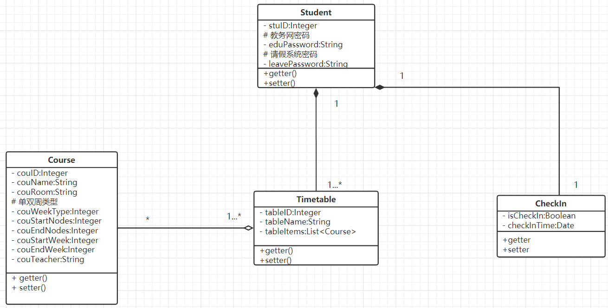

图2-4-1.1 类图

### 2.4.2主要功能说明

表2-1 主要功能

| **序号** | 功能名称     | 功能需求标识 | 优先级 | 简要解释                                                   |
|----------|--------------|--------------|--------|------------------------------------------------------------|
| **1**    | 用户认证     | L1           | 高     | 进入页面，输入学号、教务网密码、至诚信息系统密码           |
| **2**    | 周课表       | L2           | 高     | 信息认证成功后显示个人周课表                               |
| **3**    | 课前提醒     | L3           | 高     | 信息认证成功后可增添课前提醒功能                           |
| **4**    | 成绩查询     | L4           | 中     | 信息认证成功后可查询成绩单                                 |
| **5**    | 认证信息修改 | L5           | 中     | 若用户在教务网或至诚信息系统修改了密码，更改软件存储的密码 |

### 2.4.3活动图

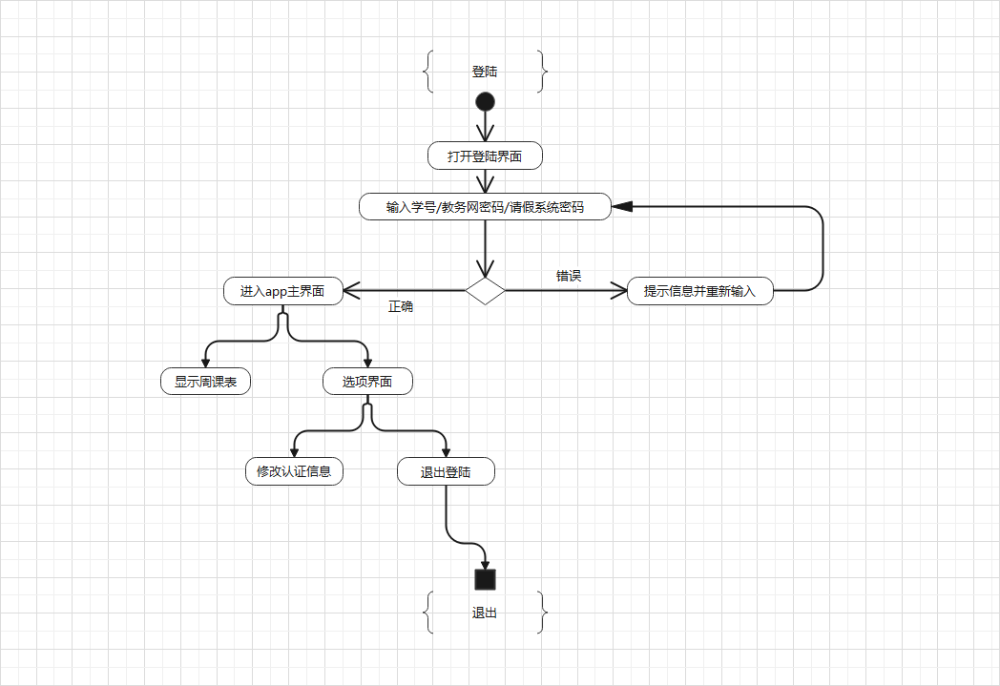

图2-4-3.1 活动图

## 2.5产品市场

该产品面对全体至诚学生，满足学生对课表查询的需求，解决学校教务网公众号“至诚教务助手”使用不便的现象，为福州大学至诚学院的学生提供校园生活的便利。

## 2.6用户特点

### 2.6.1用户群体画像

苦恼课表查询步骤繁琐和需要指纹提醒的至诚学生

### 2.6.2用户场景

表2-6-2.1 用户A场景

| 姓名     | 用户A                                                                          |
|----------|--------------------------------------------------------------------------------|
| 性别     | 男                                                                             |
| 困难     | 至诚教务助手公众号偶尔会出现崩溃的状况，无法查询课表                           |
| 典型场景 | 由于系统崩溃造成用户A无法再次进入公众号查询课表，导致用户A不知道每天的课程信息 |
| 用户定位 | 本产品提供实时课表查询，更加方便快捷                                           |

表2-6-2.2 用户B场景

| 姓名     | 用户B                                                                                                     |
|----------|-----------------------------------------------------------------------------------------------------------|
| 性别     | 男                                                                                                        |
| 困难     | 至诚教务助手公众号课表只能查看近几周课表，而不能查看完整的一学期课表                                      |
| 典型场景 | 用户B想查看最后一节课的结课时间，但是周课表只显示近几周课表，而完整课表没有提供日期，无法进行结课时间推算 |
| 用户定位 | 本产品提供实时课表查询，可以查看整个学期的所有周课表                                                      |

表2-6-2.3 用户C场景

| 姓名     | 用户C                                                                         |
|----------|-------------------------------------------------------------------------------|
| 性别     | 男                                                                            |
| 困难     | 日常迷糊，总是分不清今天上哪节课                                              |
| 典型场景 | A是一个性格大大咧咧且日常犯迷糊的小朋友，总是不知道今天的课程是什么，几点上课 |
| 用户定位 | 本产品提供课前提醒功能，可以提前通知用户上课日程                              |

表2-6-2.4 用户D场景

| 姓名     | 用户D                                                                             |
|----------|-----------------------------------------------------------------------------------|
| 性别     | 女                                                                                |
| 困难     | 对今日课程记不清课程所对应的教室                                                  |
| 典型场景 | B同学去上课的过程中需要查询教室，但登录微信进去至诚教务助手查询教室，过程相对繁琐 |
| 用户定位 | 本产品主界面提供课程对应的教室，可直接查看                                        |

表2-6-2.5 用户E场景

| 姓名     | 用户E                                                                         |
|----------|-------------------------------------------------------------------------------|
| 性别     | 男                                                                            |
| 困难     | 至诚教务助手公众号成绩查询对于每学期的分类不够明确                            |
| 典型场景 | E同学想看自己每学期的成绩，而教务助手显示的是所有学期的成绩，浏览起来不够便利 |
| 用户定位 | 本产品可以提供方便快捷的成绩查询                                              |

### 2.6.3用户需求

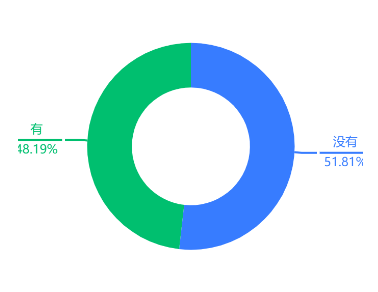

图2--6-3.1 用户使用课程表软件的情况

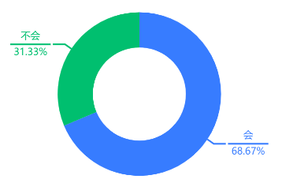

图2--6-3.2 用户是否会使用“橙汁”APP

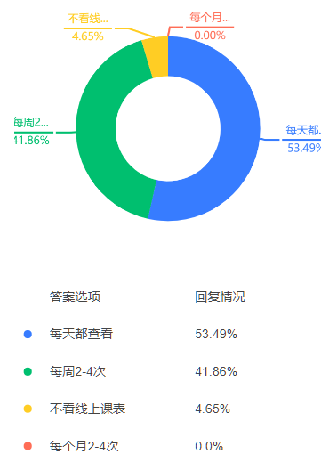

图2--6-3.3 用户使用线上课表的频率

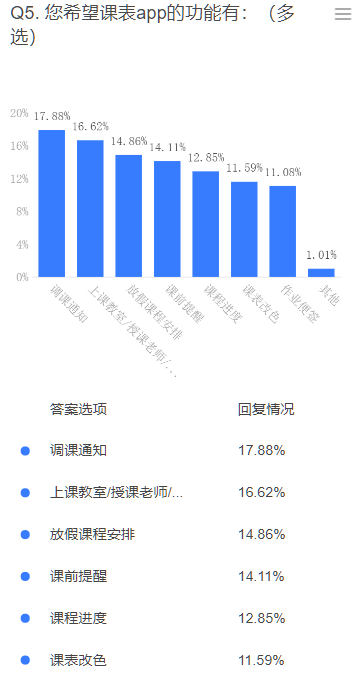

图2--6-3.4 用户期待的功能

## 2.7运行环境

运行要求：Android5.0及以上

## 2.8约束（条件与限制）

-   项目开发经验约束：PlanB组员均为大三学生，没有开发完整项目的经验，需要借鉴学习。

-   管理约束：各个组员都是第一次协作完成项目，任务的拆分和协作对组长和组员来说都是考验。当项目遇到了技术性难题由组长合理给出策略，协助队员们更好的完成此次项目。

-   技术约束：实现对至诚教务网和至诚信息系统的模拟登录存在一定的难度；至诚教务网验证码的识别也存在一定的难度。

-   网络传输约束：用户网络速率会影响软件的用户体验，软件数据的获取依赖手机与教务网和至诚信息系统的网络连接。

-   安全和保密约束：对用户敏感数据的存储和传输进行加密。

# 第三章 运行接口需求

## 3.1用户界面

###  3.1.1登录及主界面

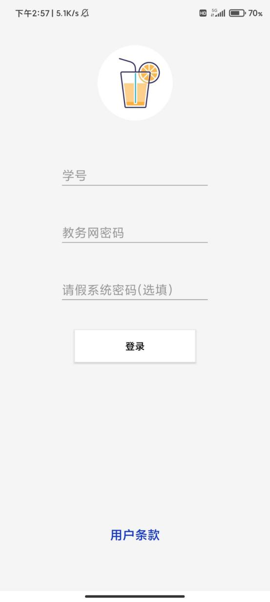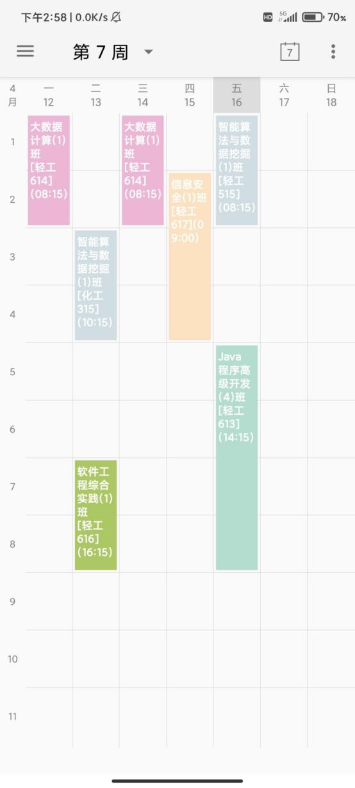

>   图3-1-1 主界面 图3-1-2 周课表

### 3.1.2菜单栏界面

### 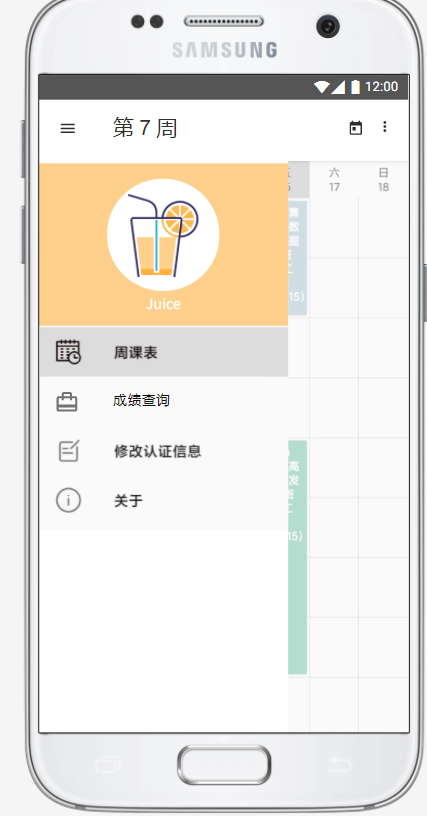

图3-5 功能选项

### 3.1.3成绩查询界面

### 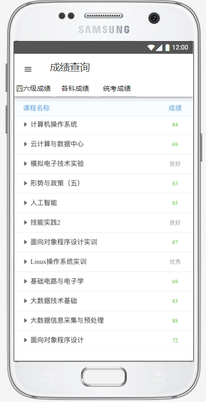

图3-5 功能选项

### 3.1.4认证更新界面 

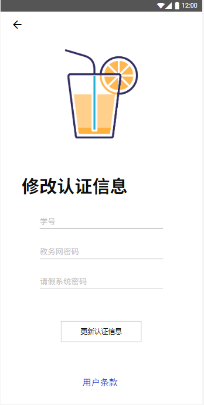

>   图3-7 认证信息修改

## 3.2硬件接口

-   客户端

    -   Android兼容的手机

        -   网络连接支持

## 3.3软件接口

-   客户端

-   Android版本5.0及以上

## 3.4通信接口

-   网络连接使用HTTP

# 第四章 非功能性需求

## 4.1性能需求

-   支持100+人同时发起请求获取课表或读取成绩信息

## 4.2软件属性

###  4.2.1软件可靠性

-   在Android5.0及以上的系统稳定运行

-   在软件非正常退出时，确保用户数据不丢失

###  4.2.2可用性

-   并发性：支持多用户同时请求数据

-   操作便捷：简单快捷地获取课表及签到信息

-   界面简洁：没有广告或其他无用的界面

###  4.2.3安全保密性

-   最小权限原则：只获取必要的权限，保护用户的隐私

-   数据传输：使用教务网和至诚信息系统指定的加密规则对数据进行加密传输

-   本地存储：对于用户的敏感数据进行加密存储

###  4.2.4可维护性

-   版本控制：使用版本控制工具辅助开发

-   开发规范：根据实际情况制定合适的开发规范，共同遵守，提高代码可读性和可维护性

-   模块化设计：各个功能采用模块化设计，便于各个模块的设计开发与维护

# 第五章 验证验收标准

表5-1 验证验收标准

| **测试功能**       | **测试项**            | **输入/操作**                                                   | **检验点**                             | **预期结果**                                                                               | **验收情况** |
|--------------------|-----------------------|-----------------------------------------------------------------|----------------------------------------|--------------------------------------------------------------------------------------------|--------------|
| **登录** **界面**  | 初始界面              | 点击账号和密码的文本框（若存在登陆信息，跳过）                  | 账号、密码键入提示                     | 账号和密码的文本框显示键入提示且可键入                                                     |              |
|                    |                       | 键入账号文本框、输入文本                                        | 账号为9位数学号                        | 对于不满足学号要求的文本可以进行预先识别、并提示                                           |              |
|                    |                       | 键入密码文本框、输入password                                    | 教务网密码                             | 对不符合密码规则的文本进行预先识别、并提示                                                 |              |
|                    |                       | 键入密码文本框、输入password（选填）                            | 至诚信息系统密码                       | 对不符合密码规则的文本进行预先识别、并提示                                                 |              |
|                    |                       |                                                                 | APP Logo                               | Logo图标清晰完整                                                                           |              |
|                    | 登录功能              | 点击“登录”按钮， 学号，教务网、至诚信息系统密码都填写并且正确   | 账号密码校验，并显示登录结果信息       | 成功进入主界面                                                                             |              |
|                    |                       | 点击“登录”按钮，未写学号                                        | 显示提示信息                           | 提示“未输入学号”                                                                           |              |
|                    |                       | 点击“登录”按钮， 学号正确，未输入密码                           | 显示提示信息                           | 提示“未输入密码”                                                                           |              |
|                    |                       | 点击“登录”按钮， 学号格式错误或学号未存在                       | 显示提示信息                           | 提示“学号有误”                                                                             |              |
|                    |                       | 点击“登录”按钮， 学号正确，教务网密码正确，至诚信息系统密码未填 | 账号密码校验，并显示提示信息           | 进入主界面，仅显示课表，签到提示功能、本班未签功能停用                                     |              |
|                    |                       | 点击登陆按钮，学号正确，教务网密码错误，至诚信息系统密码正确    | 账号密码校验，并显示提示信息           | 提示“教务网密码出错”                                                                       |              |
|                    |                       | 点击登陆按钮，学号正确，教务网密码正确，至诚信息系统密码错误    | 账号密码校验，并显示提示信息           | 提示“至诚信息系统密码出错”                                                                 |              |
|                    |                       | 点击登陆按钮，未输入任何信息                                    | 显示提示信息                           | 提示“未输入学号”                                                                           |              |
| **主界面**         |  课程表信息           |                                                                 | 初始界面                               | 不同颜色的色块显示课程信息，在签到时间段显示签到情况信息                                   |              |
|                    |                       | 动作——下拉                                                      | 刷新课表                               | 将课表刷新至最新状态                                                                       |              |
|                    |                       | 动作——左右滑动                                                  | 切换课表                               | 切换当前显示的周课表                                                                       |              |
| **菜单栏**         |  侧边菜栏界面         | 点击“周课表”                                                    | 初始界面                               | 显示功能点：查询本班未签记录、修改认证信息、用户退出登录                                   |              |
|                    |                       | 点击“成绩查询”                                                  | “成绩查询”功能                         | 进入“成绩查询”详情页面                                                                     |              |
|                    |                       | 点击“修改认证信息”                                              | “修改认证信息”功能                     | 进入“修改认证信息”详情界面                                                                 |              |
|                    |                       | 点击“关于”                                                      | “关于”功能                             | 显示“橙汁“开发团队信息，版本信息                                                           |              |
| **查询成绩界面**   | 个人成绩界面 详情界面 | 用户录入了至诚信息系统密码                                      | 初始界面                               | 显示个人四六级成绩、各科成绩、统考成绩                                                     |              |
|                    |                       | 用户未录入至诚信息系统密码                                      | 初始界面                               | 显示“未录入至诚信息系统密码，在修认证信息中添加密码后即可使用该功能”                       |              |
| **修认证信息界面** | 修认证信息详情界面    | 点击“更新认证信息”、输入新学号，未输入密码                      | 更新学号                               | 提示“更新学号”                                                                             |              |
|                    |                       | 未输入任何信息                                                  | 保持默认信息                           | 提示“未修改信息”                                                                           |              |
|                    |                       | 点击“更新认证信息”按钮，只填写新的教务网密码                    | 更新教务网密码                         | 提示“更新教务网密码”                                                                       |              |
|                    |                       | 点击“更新认证信息”按钮，只填写新的至诚信息系统密码              | 更新至诚信息系统密码                   | 提示“更新至诚信息系统密码”                                                                 |              |
|                    |                       | 点击“更新认证信息”按钮， 修改学号，教务网密码                   | 更新学号、教务网密码                   | 提示“更新学号、教务网密码”                                                                 |              |
|                    |                       | 点击“更新认证信息”按钮， 修改学号，至诚信息系统密码             | 更新学号 至诚信息系统密码              | 提示“更新学号、至诚信息系统密码”                                                           |              |
|                    |                       | 点击“更新认证信息”按钮， 修改学号、教务网密码、至诚信息系统密码 | 更新学号、教务网密码、至诚信息系统密码 | 提示“更新学号、教务网密码、至诚信息系统密码”                                               |              |
|                    |                       |                                                                 | APP Logo                               | Logo图标清晰完整                                                                           |              |
|                    | 修改认证信息功能      | 点击“修改认证信息”按钮                                          | 账号密码校验，并显示登录结果信息       | 对于非法文本，以及账号密码不匹配的情况，返回登录失败信息，成功，将数据进行刷新并返回主界面 |              |
